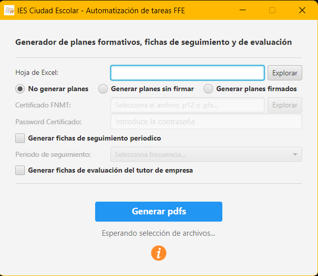

# 📝 FFE - Churrera de documentación

👨‍🏫 IES: Ciudad Escolar

📥 Depto: Informática y Comunicaciones

🧑‍💻 Profesor: José Sala Gutiérrez

---

## Descripción del proyecto

El objetivo de este proyecto no es otro que facilitar el trabajo burocrático de los docentes tutores de prácticas de FFE (Fase de Formación en Empresa) de los ciclos formativos de FP en centros de la Comunidad de Madrid, en concreto, en el IES Ciudad Escolar.

En este proyecto se automatiza, para un determinado curso y ciclo formativo, la creación de la siguiente documentación en `pdf`:

1) **los planes formativos**
2) **las fichas de seguimiento**
3) **las fichas de evaluación del tutor de empresa**

Para ello se utilizan las plantillas publicadas en la Comunidad de Madrid y un fichero Excel donde se centraliza toda la información del ciclo de los alumnos:

- `datos_ffe.xlsx`: fichero excel con dos tabs. El primero con los atributos comunes de todos los planes formativos, fichas y valoraciones del tutor y el segundo con los registros de cada uno de los alumnos.
- `anexo_plan_de_formacion_editable.pdf`: plantilla propia de la Comunidad de Madrid (marzo 2026).
- `anexo_ficha_seguimiento_editable.pdf`: plantilla propia de la Comunidad de Madrid (marzo 2026).
- `anexo_valoracion_final_tutor_editable.pdf`: plantilla propia de la Comunidad de Madrid (marzo 2026).

La aplicación permite generar de una vez todos los documentos o también generar los tipos que el docente necesite en cada fase de las FFEs. Al finalizar la ejecución, dependiendo de las opciones seleccionadas por el docente, se habrán creado:

1. Un **plan formativo** por cada alumno usando la nombreclatura solicitada por jefatura de estudios para subir los ficheros al formulario:

    ```text
        CodigoCiclo_planes_sin_firmar\Apellido1Alumno_Apellido2Alumno_CodigoCiclo.pdf
        CodigoCiclo_planes_sin_firmar\Apellido1Alumno_CodigoCiclo.pdf (alumnos con un único apellido)

        CodigoCiclo_planes_firmados\Apellido1Alumno_Apellido2Alumno_CodigoCiclo.pdf
        CodigoCiclo_planes_firmados\Apellido1Alumno_CodigoCiclo.pdf (alumnos con un único apellido)
    ```

2. Una **ficha de seguimiento** por cada periodo (ficha única, semanal o mensual) y alumno.

    ```text
        CodigoCiclo_fichas_seguimiento\Apellido1Alumno_Apellido2Alumno_CodigoCiclo_Periodo.pdf
        CodigoCiclo_fichas_seguimiento\Apellido1Alumno_CodigoCiclo_Periodo.pdf (alumnos con un único apellido)
    ```

3. Una **ficha de valoración final** del tutor de empresa por cada alumno.

    ```text
        CodigoCiclo_eval_tutor_empresa\Apellido1Alumno_Apellido2Alumno_CodigoCiclo.pdf
        CodigoCiclo_eval_tutor_empresa\Apellido1Alumno_CodigoCiclo.pdf (alumnos con un único apellido)
    ```

Cada tipo de documento se genera en una carpeta independiente.

## Interfaz gráfica

La aplicación cuenta con una interfaz gráfica intuitiva y sencilla:



## Releases

Para facilitar la distribución de la herramienta se ha generado una release con todo lo necesario para poder ejecutarlo. La puedes encontrar en la sección  `releases` dentro de este repositorio de GitHub como un fichero ZIP.

```text
ChurreraFFE_v6.0.1.zip (última versión)
```

## Manual de instrucciones

Para poder utilizar esta herramienta, sigue los siguientes pasos:

1) Descarga la release publicada

2) Descomprime el fichero en tu directorio personal de trabajo (ej. C:\Users\xxx)

3) Modifica el fichero `datos_ffe.xlsx` incluido en el directorio comprimido añadiendo los registros con los datos de cada alumno que vaya a realizar la FFE y también modificando los datos comunes de acuerdo al IES, Ciclo, Módulos evaluados, RAs involucrados, tutor docente...

4) Haz doble clic en el ejecutable `ChurreraFFE.exe` y se abrirá la ventana de la aplicación. Si Windows lo identifica como software no seguro, solo es debido a no haber abonado los 200€ anuales que exigen para evitar esa ventanita azul tan molesta. Te aseguro que no tiene ningún tipo de malware.

5) Arrancada la aplicación, lo primero es siempre Seleccionar el fichero excel modificado en el paso 3. Para ello haz clic en explorar y localízalo en tu PC.

6) A continuación puedes marcar qué documentos quieres generar siendo obligatorio seleccionar al menos un tipo.

7) Si se quieren generar los planes, existen dos opciones, una es generarlos sin firma digital y otra (aún mejor) generarlos con nuestra firma digital. Para activar la segunda opción es necesario disponer de certificado digital de la FNMT y proceder del siguiente modo:
   1) Activar la opción "Generar planes firmados".
   2) Seleccionar el certificado personal de FNMT con extensión .p12.
   3) Indicar la contraseña de la clave privada de dicho certificado.

8) Si se quieren generar las fichas de seguimiento de los alumnos de acuerdo a un determinado periodo, se debe proceder del siguiente modo:
   1) Activar la opción "Generar fichas seguimiento periodico"
   2) Seleccionar el periodo convenido (una ficha única, una ficha semanal o una ficha mensual).

9) Si se quieren generar las fichas de valoración final del tutor de empresa, proceder del siguiente modo:
   1) Activar la opción "Generar fichas de evaluación del tutor de empresa"

10) Finalmente, una vez marcados los tipos de documentos a generar, hacer clic sobre el botón de `Generar pdfs`

11) Tras la ejecución, revisa que todos los documentos se han generado correctamente y que el contenido se ajusta a lo esperado:

    - Los pdfs de planes sin firmar estarán en una carpeta `<codigo_ciclo>_planes_sin_firmar` y los firmados en `<codigo_ciclo>_planes_firmados`.
    - Los pdfs de fichas estarán en una carpeta `<codigo_ciclo>_fichas_seguimiento`.
    - Los pdfs de evaluación estarán en una carpeta `<codigo_ciclo>_eval_tutor_empresa`.

    Si hubiera algun error, actualiza de nuevo el fichero Excel y re-ejecuta la aplicación. Los documentos generados se sobrescriben.

## Tecnologías utilizadas

- Maven + Java 21 (LTS)
- slf4j + Logback
- itextpdf
- jpackage + signtool
- java security + bouncycastle
- apache poi
- JavaFX

## Bug fixing

- Adaptación de los ficheros de entrada
- Se eliminan los nombres de los pié de firmas
- Se añade email de empresa
- De acuerdo a jefatura de estudios (11/02/26), el periodo de FFEs en 2º será siempre `periodo número 2`
- Se traslada como campos dependientes del alumno las adaptaciones extraordinarias por discapacidad y las autorizaciones extraordinarias.

## Versiones

- v1.0.1: Permite generar los planes de formación con el formato antiguo a partir de dos ficheros txt.
- v2.0.1: Permite generar los planes de formación con el formato nuevo y posteriormente firmarlos a partir de dos ficheros txt.
- v3.0.0: Permite generar los planes de formación con el formato nuevo y posteriormente firmarlos a partir de un fichero excel.
- v4.0.0: Se añade interfaz gráfica para facilitar su uso por parte de los docentes.
- v5.0.0: Se añade la funcionalidad de generar las fichas de seguimiento.
- v6.0.0: Se añade la funcionalidad de generar las fichas de evaluación de los tutores de empresa y la generación de planes se vuelve opcional.
- v6.0.1: Se corrige la nomenclatura de los planes firmados y se actualiza la información de ayuda en el "acerca de".
